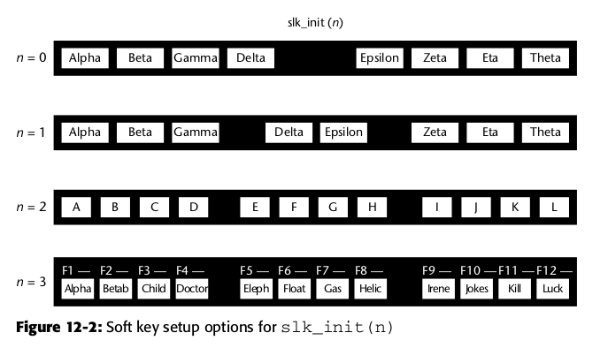

# stress-go
a stress testing tool（压测工具）

### 目录结构

```
|---- main.go // main主函数
|---- cgo
|      |---- stdout_output.go
|      |---- stdout_output.c
|      |---- stdout_output.h
|      |---- color.go
|      |---- color.c
|      |---- color.h
|---- server
|       |---- server.go // 压测启动，注册验证器、启动统计函数、启动协程进行压测
|       |---- golink
|       |       |---- http_link.go
|       |---- client
|       |       |---- http_client.go
|---- helper
|      |---- helper.go
|---- model
|      |---- request_model.go // 请求数据模型


```

### 用法
```
Usage:
    -c unit 并发数,默认1
    -d string 调试模式 默认false
    -data string HTTP POST方式传送数据
    -n unit 请求总数 默认1
    -p string curl文件路径
    -u string 压测地址
    -v string 验证方法 http支持：statusCode、json webSocket支持：json
    -H value 自定义头信息传递给服务器 示例： -header 'Content-Type: application/json' -H 'referer: https://realjf.io'
```


### ncurses

```shell
# 核心库
libncurses.a (正常)
libncurses.so (共享)
libncurses_g.a (启用调试和跟踪代码)
libncurses_p.a (已启用性能分析)

# 面板
libpanel.a
libpanel.so

# 菜单
libmenu.a
libmenu.so

# 表单
libform.a
libform.so

# 使用 --enable-widec 进行编译时，库名称后面加w，如ncursesw.a，标识支持宽字符

```
#### 软标签初始化值n的标签数量与排列关系

